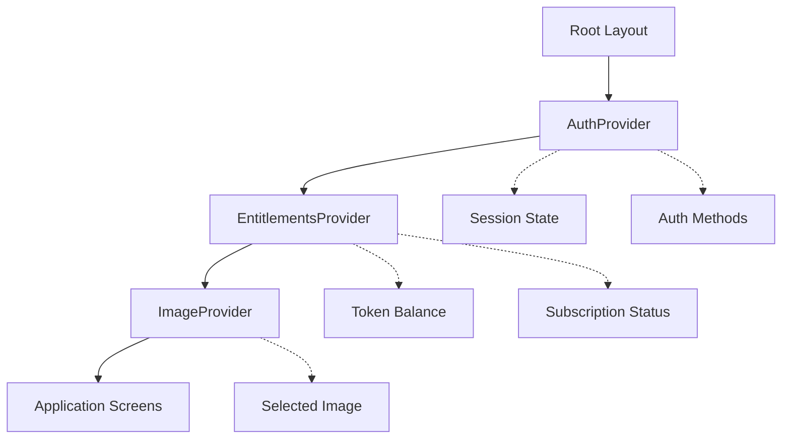
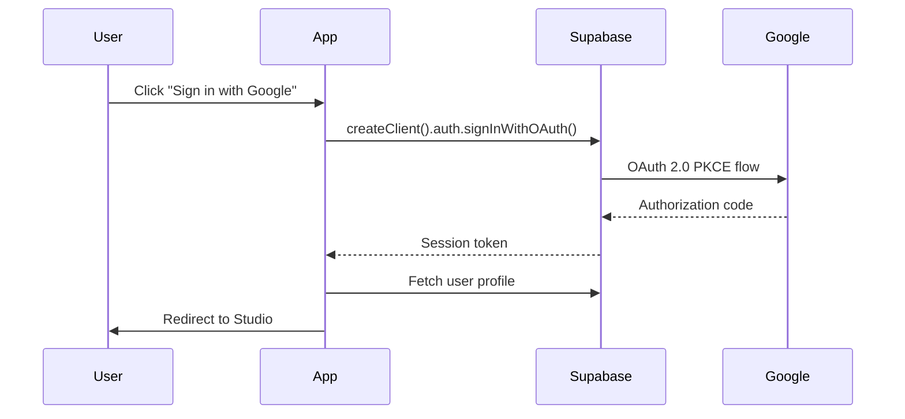
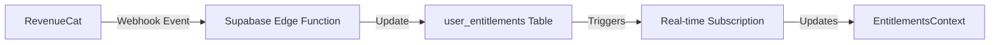
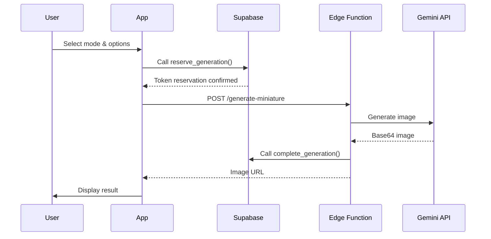

# MiniStudio Architecture Guide

A comprehensive guide to understanding and replicating the MiniStudio
application architecture.

---

## Table of Contents

1. [Executive Summary](#executive-summary)
2. [Technology Stack](#technology-stack)
3. [Project Structure](#project-structure)
4. [Core Architecture Patterns](#core-architecture-patterns)
5. [Database Schema](#database-schema)
6. [Service Layer](#service-layer)
7. [State Management](#state-management)
8. [UI Architecture](#ui-architecture)
9. [Backend Services](#backend-services)
10. [Replication Guide](#replication-guide)

---

## Executive Summary

**MiniStudio** is an AI-powered mobile application built with React Native that
enables tabletop hobbyists to visualize painting styles on miniatures. The app
demonstrates a modern, production-ready architecture with:

- **Cross-platform support** (iOS, Android, Web)
- **Cloud-based authentication & database** (Supabase)
- **Subscription management** (RevenueCat)
- **AI image generation** (Google Gemini API)
- **Modern styling** (NativeWind/Tailwind CSS)
- **File-based routing** (Expo Router)

---

## Technology Stack

### Frontend Framework

- **React Native** 0.81.5
- **React** 19.1.0
- **Expo SDK** ~54.0
- **TypeScript** ~5.9.2

### Routing & Navigation

- **Expo Router** ~6.0.21 (File-based routing)
- React Navigation integration

### Styling

- **NativeWind** ^4.1.23 (Tailwind CSS for React Native)
- **Tailwind CSS** ^3.4.0
- Custom design tokens system

### State Management

- **React Context API** for global state
  - `AuthContext` - User authentication & session
  - `EntitlementsContext` - Subscription & token management
  - `ImageContext` - Image selection state
- **React Hooks** for local state

### Backend Services

- **Supabase** ^2.49.1
  - PostgreSQL database
  - Authentication (Email, Google OAuth, Anonymous)
  - Edge Functions (Deno runtime)
  - Migrations system
- **Supabase Edge Functions**
  - `generate-miniature` - AI generation orchestration
  - `revenuecat-webhook` - Subscription webhooks
  - `poyo-webhook` - Alternative API webhooks

### Monetization

- **RevenueCat** (react-native-purchases ^9.6.15)
  - Subscription management
  - Cross-platform purchase handling
  - Webhook integration for real-time updates

### AI/ML Services

- **Google Gemini API** (@google/genai ^1.27.0)
- Alternative POYO API support

### Platform APIs

- **Expo Camera** ~17.0.10
- **Expo Image Picker** ~17.0.10
- **Expo Media Library** ~18.2.1
- **Expo File System** ~19.0.21
- **Expo Secure Store** ~15.0.8 (API key storage)

### UI Components

- **@gorhom/bottom-sheet** ^5.2.8
- **react-native-reanimated** ~4.1.1
- **react-native-gesture-handler** ~2.28.0
- **react-native-svg** 15.12.1

### Development Tools

- **EAS Build** (Expo Application Services)
- Babel with NativeWind presets
- Metro bundler with custom config

---

## Project Structure

```
ministudio/
├── app/                              # Expo Router screens (file-based routing)
│   ├── _layout.tsx                   # Root layout with providers
│   ├── index.tsx                     # Welcome/landing screen
│   ├── signin.tsx                    # Sign-in screen
│   ├── signup.tsx                    # Sign-up screen
│   ├── camera.tsx                    # Camera capture screen
│   ├── settings.tsx                  # Settings screen
│   ├── paywall.tsx                   # Subscription paywall
│   ├── (studio)/                     # Studio group routes
│   │   ├── _layout.tsx               # Studio layout
│   │   └── index.tsx                 # Main studio interface
│   └── admin/                        # Admin panel routes
│       ├── _layout.tsx
│       └── index.tsx
│
├── src/                              # Application source code
│   ├── components/                   # Reusable UI components
│   │   ├── AppModal.tsx              # Standard app modal dialog
│   │   ├── PaywallDrawer.tsx         # Subscription drawer
│   │   ├── Icons.tsx                 # SVG icon library
│   │   ├── LoadingOverlay.tsx        # Loading states
│   │   ├── Toast.tsx                 # Toast notifications
│   │   ├── UsageTracker.tsx          # Token usage display
│   │   └── studio/                   # Studio-specific components
│   │       ├── StudioHeader.tsx
│   │       └── StudioFooter.tsx
│   │
│   ├── context/                      # React Context providers
│   │   ├── AuthContext.tsx           # Authentication state & methods
│   │   ├── EntitlementsContext.tsx   # Subscriptions & tokens
│   │   └── ImageContext.tsx          # Image selection state
│   │
│   ├── services/                     # Service layer (API clients)
│   │   ├── supabase.ts               # Supabase client instance
│   │   ├── geminiService.ts          # Gemini AI integration
│   │   ├── paintService.ts           # Paint database queries
│   │   ├── promptService.ts          # Prompt generation
│   │   ├── purchaseService.ts        # RevenueCat integration
│   │   ├── storageService.ts         # Secure storage utilities
│   │   ├── fileSystemService.ts      # File operations
│   │   └── adminService.ts           # Admin API calls
│   │
│   ├── hooks/                        # Custom React hooks
│   │   ├── useCamera.ts
│   │   ├── useImagePicker.ts
│   │   ├── useMediaSave.ts
│   │   └── useEntitlements.ts
│   │
│   ├── theme/                        # Design system tokens
│   │   ├── index.ts                  # Unified export
│   │   ├── colors.ts                 # Color palette
│   │   ├── typography.ts             # Font system
│   │   └── spacing.ts                # Spacing, dimensions, shadows
│   │
│   ├── types/                        # TypeScript type definitions
│   │   └── index.ts
│   │
│   ├── utils/                        # Utility functions
│   │   ├── validation.ts
│   │   └── formatting.ts
│   │
│   └── constants.ts                  # App-wide constants
│
├── supabase/                         # Supabase backend
│   ├── migrations/                   # Database migrations (chronological)
│   │   ├── 20260111164500_init_paywall.sql
│   │   ├── 20260111173000_add_token_system.sql
│   │   ├── 20260130100000_poyo_integration.sql
│   │   ├── 20260201000000_unified_token_pool.sql
│   │   └── ...
│   │
│   └── functions/                    # Edge Functions (Deno)
│       ├── generate-miniature/
│       │   └── index.ts              # AI generation orchestration
│       ├── revenuecat-webhook/
│       │   └── index.ts              # RevenueCat event handler
│       └── poyo-webhook/
│           └── index.ts              # Alternative API webhook
│
├── assets/                           # Static assets
│   ├── icon.png                      # App icon (1024x1024)
│   ├── adaptive-icon.png             # Android adaptive icon
│   ├── splash-icon.png               # Splash screen icon
│   └── ...
│
├── docs/                             # Documentation
│
├── Configuration Files
├── app.json                          # Expo configuration
├── eas.json                          # EAS Build configuration
├── package.json                      # Dependencies
├── tsconfig.json                     # TypeScript config
├── tailwind.config.js                # Tailwind/NativeWind config
├── babel.config.js                   # Babel configuration
├── metro.config.js                   # Metro bundler config
├── global.css                        # Global Tailwind styles
└── DESIGN_SYSTEM.md                  # Design system documentation
```

### Key Files

| File                                                                | Purpose                                                      |
| ------------------------------------------------------------------- | ------------------------------------------------------------ |
| [app.json](file:///d:/APPS/MiniStudio/app.json)                     | Expo configuration, platform settings, environment variables |
| [package.json](file:///d:/APPS/MiniStudio/package.json)             | Dependencies and scripts                                     |
| [DESIGN_SYSTEM.md](file:///d:/APPS/MiniStudio/DESIGN_SYSTEM.md)     | Comprehensive design guidelines                              |
| [tailwind.config.js](file:///d:/APPS/MiniStudio/tailwind.config.js) | Design tokens, colors, typography                            |

---

## Core Architecture Patterns

### 1. File-Based Routing (Expo Router)

**Pattern**: Routes are defined by the file structure in the `app/` directory.

```
app/
├── _layout.tsx           → Root layout
├── index.tsx             → / (home)
├── camera.tsx            → /camera
├── settings.tsx          → /settings
├── (studio)/             → Group (doesn't add route segment)
│   ├── _layout.tsx
│   └── index.tsx         → /
└── admin/
    └── index.tsx         → /admin
```

**Benefits**:

- No route configuration files
- Automatic deep linking
- Type-safe navigation with TypeScript

**Example**: [app/_layout.tsx](file:///d:/APPS/MiniStudio/app/_layout.tsx)

### 2. Context-Based State Management

**Pattern**: Global application state managed via React Context API.



**Key Contexts**:

| Context               | Responsibility                          | Key State                        |
| --------------------- | --------------------------------------- | -------------------------------- |
| `AuthContext`         | User authentication, session management | `session`, `user`, `isAnonymous` |
| `EntitlementsContext` | Subscriptions, token tracking           | `entitlements`, `tokenBalance`   |
| `ImageContext`        | Image selection state                   | `selectedImage`                  |

**Example**:
[AuthContext.tsx](file:///d:/APPS/MiniStudio/src/context/AuthContext.tsx)

### 3. Service Layer Architecture

**Pattern**: Business logic and API interactions are abstracted into service
modules.

```typescript
// Service pattern example
// src/services/geminiService.ts

import { supabase } from "./supabase";
import { GoogleGenerativeAI } from "@google/genai";

export class GeminiService {
    async generateImage(params: GenerationParams): Promise<ImageResult> {
        // 1. Validate user tokens (via Supabase RPC)
        // 2. Generate prompt
        // 3. Call AI API
        // 4. Process result
        // 5. Update database
    }
}
```

**Services**:

- `supabase.ts` - Supabase client singleton
- `geminiService.ts` - AI generation orchestration
- `paintService.ts` - Paint database queries
- `purchaseService.ts` - RevenueCat integration
- `storageService.ts` - Secure local storage
- `promptService.ts` - Dynamic prompt generation
- `adminService.ts` - Admin API calls

### 4. Design System Integration

**Pattern**: Centralized design tokens with NativeWind (Tailwind CSS).

```typescript
// src/theme/index.ts
export { colors } from "./colors";
export { fontFamily, fontSize, fontWeight, textStyles } from "./typography";
export { borderRadius, dimensions, shadows, spacing } from "./spacing";

// Usage in components
import { colors, textStyles } from "@/theme";

const styles = StyleSheet.create({
    container: {
        backgroundColor: colors.background.primary,
    },
    title: {
        ...textStyles.heading,
    },
});
```

**NativeWind (Tailwind) Usage**:

```tsx
// Utility-first styling with className
<View className="bg-background-primary p-6 rounded-full">
    <Text className="text-text-primary font-semibold text-lg">Title</Text>
</View>;
```

**Configuration**:
[tailwind.config.js](file:///d:/APPS/MiniStudio/tailwind.config.js)

### 5. Component Patterns

#### Modal Dialog Pattern

```tsx
// AppModal.tsx - Reusable modal component
<AppModal
    visible={visible}
    title="Confirm Action"
    message="Are you sure?"
    type="error" // 'default' | 'error' | 'critical'
    primaryAction={{ label: "Confirm", onPress: handleConfirm }}
    secondaryAction={{ label: "Cancel", onPress: handleCancel }}
/>;
```

#### Bottom Sheet/Drawer Pattern

```tsx
// Using @gorhom/bottom-sheet
<BottomSheet
    ref={bottomSheetRef}
    snapPoints={["25%", "50%", "90%"]}
    backgroundStyle={{ backgroundColor: colors.background.secondary }}
>
    {/* Content */}
</BottomSheet>;
```

---

## Database Schema

### Supabase PostgreSQL Schema

The database uses **migrations** stored in `supabase/migrations/` for version
control.

#### Core Tables

##### `auth.users` (Managed by Supabase Auth)

- `id` - UUID (Primary Key)
- `email` - Email address
- `created_at` - Timestamp
- **Extended by custom tables**

##### `user_entitlements`

```sql
CREATE TABLE user_entitlements (
  id UUID PRIMARY KEY DEFAULT gen_random_uuid(),
  user_id UUID REFERENCES auth.users(id) ON DELETE CASCADE,
  subscription_status TEXT DEFAULT 'free',
  subscription_tier TEXT,
  token_balance INTEGER DEFAULT 0,
  free_tokens INTEGER DEFAULT 10,
  purchased_tokens INTEGER DEFAULT 0,
  last_refill_date TIMESTAMPTZ,
  created_at TIMESTAMPTZ DEFAULT NOW(),
  updated_at TIMESTAMPTZ DEFAULT NOW()
);
```

**Purpose**: Track user subscriptions, token balances, and entitlements.

##### `generation_logs`

```sql
CREATE TABLE generation_logs (
  id BIGSERIAL PRIMARY KEY,
  user_id UUID REFERENCES auth.users(id) ON DELETE CASCADE,
  mode TEXT,
  status TEXT,
  tokens_used INTEGER,
  created_at TIMESTAMPTZ DEFAULT NOW()
);
```

**Purpose**: Audit trail of AI generation requests.

##### `saved_images`

```sql
CREATE TABLE saved_images (
  id UUID PRIMARY KEY DEFAULT gen_random_uuid(),
  user_id UUID REFERENCES auth.users(id) ON DELETE CASCADE,
  image_url TEXT NOT NULL,
  thumbnail_url TEXT,
  metadata JSONB,
  created_at TIMESTAMPTZ DEFAULT NOW()
);
```

**Purpose**: Store user's generated and saved images.

##### `paint_colors` (Example data table)

```sql
CREATE TABLE paint_colors (
  id SERIAL PRIMARY KEY,
  brand TEXT NOT NULL,
  name TEXT NOT NULL,
  hex_color TEXT NOT NULL,
  type TEXT, -- 'base', 'layer', 'shade', etc.
  created_at TIMESTAMPTZ DEFAULT NOW()
);
```

**Purpose**: Paint brand color database for palette selection.

##### `prompts`

```sql
CREATE TABLE prompts (
  id UUID PRIMARY KEY DEFAULT gen_random_uuid(),
  type TEXT NOT NULL, -- 'paint', 'render', 'sketch'
  category TEXT,
  content TEXT NOT NULL,
  is_active BOOLEAN DEFAULT TRUE,
  created_at TIMESTAMPTZ DEFAULT NOW()
);
```

**Purpose**: Dynamic prompt templates for AI generation.

#### Key RPC Functions

The app uses **Remote Procedure Calls (RPCs)** for complex database operations:

##### `reserve_generation()`

```sql
CREATE OR REPLACE FUNCTION reserve_generation(
  p_user_id UUID,
  p_cost INTEGER
)
RETURNS JSONB AS $$
  -- Atomically check and reserve tokens
  -- Returns { success: boolean, balance: number, error?: string }
$$;
```

**Purpose**: Atomically check and reserve tokens before generation.

##### `complete_generation()`

```sql
CREATE OR REPLACE FUNCTION complete_generation(
  p_user_id UUID,
  p_generation_id BIGINT,
  p_success BOOLEAN,
  p_actual_cost INTEGER
)
RETURNS VOID AS $$
  -- Deduct tokens on success or refund on failure
$$;
```

**Purpose**: Complete the generation transaction (deduct on success).

##### `get_user_status()`

```sql
CREATE OR REPLACE FUNCTION get_user_status(p_user_id UUID)
RETURNS JSONB AS $$
  -- Returns comprehensive user status including:
  -- - Token balances (free, purchased, total)
  -- - Subscription status and tier
  -- - Usage statistics
$$;
```

**Purpose**: Fetch all user entitlement data in one call.

#### Row-Level Security (RLS)

Supabase uses PostgreSQL Row-Level Security for data isolation:

```sql
-- Example RLS policy
ALTER TABLE saved_images ENABLE ROW LEVEL SECURITY;

CREATE POLICY "Users can view their own images"
  ON saved_images
  FOR SELECT
  USING (auth.uid() = user_id);

CREATE POLICY "Users can insert their own images"
  ON saved_images
  FOR INSERT
  WITH CHECK (auth.uid() = user_id);
```

**Migrations**:
[supabase/migrations/](file:///d:/APPS/MiniStudio/supabase/migrations)

---

## Service Layer

### Authentication Service

**Implementation**:
[AuthContext.tsx](file:///d:/APPS/MiniStudio/src/context/AuthContext.tsx)

**Authentication Methods**:

- Email/Password (Sign up, Sign in)
- Google OAuth (with PKCE)
- Anonymous/Guest sessions

**Flow Diagram**:



**Key Features**:

- Session persistence via AsyncStorage
- Automatic token refresh
- Email confirmation flow
- Password reset flow
- Anonymous session with upgrade path

### RevenueCat Integration

**Implementation**:
[purchaseService.ts](file:///d:/APPS/MiniStudio/src/services/purchaseService.ts)

**Subscription Tiers**:

- Free (10 tokens/month)
- Pro Monthly (100 tokens/month)
- Pro Annual (1200 tokens/year + savings)
- Token Packs (one-time purchases)

**Integration Points**:

1. **App Initialization**
   ([app/_layout.tsx](file:///d:/APPS/MiniStudio/app/_layout.tsx))
   ```typescript
   Purchases.configure({ apiKey: REVENUECAT_KEYS.apple });
   ```

2. **Subscription Check** (EntitlementsContext)
   ```typescript
   const customerInfo = await Purchases.getCustomerInfo();
   const isProUser = customerInfo.entitlements.active["pro"] !== undefined;
   ```

3. **Webhook Handler** (Supabase Edge Function)
   ```typescript
   // supabase/functions/revenuecat-webhook/index.ts
   // Listens for purchase events and updates user_entitlements
   ```

**Webhook Flow**:



### Gemini AI Service

**Implementation**:
[geminiService.ts](file:///d:/APPS/MiniStudio/src/services/geminiService.ts)

**Generation Flow**:



**Key Features**:

- Prompt engineering with dynamic templates
- Token-based cost calculation
- Retry logic with exponential backoff
- Error handling and user feedback

---

## State Management

### Global State (Contexts)

#### AuthContext

**Provides**:

```typescript
interface AuthContextType {
    session: Session | null;
    user: User | null;
    loading: boolean;
    isAnonymous: boolean;
    signInWithGoogle: () => Promise<void>;
    signInWithEmail: (email: string, password: string) => Promise<void>;
    signUpWithEmail: (email: string, password: string) => Promise<void>;
    signOut: () => Promise<void>;
    signInAnonymously: () => Promise<void>;
    resetGuestSession: () => Promise<void>;
    resetPasswordForEmail: (email: string) => Promise<void>;
    resendConfirmationEmail: (email: string) => Promise<void>;
}
```

**Usage**:

```typescript
const { user, signInWithGoogle, signOut } = useAuth();
```

#### EntitlementsContext

**Provides**:

```typescript
interface EntitlementsContextType {
    entitlements: {
        subscription_status: string;
        subscription_tier: string;
        token_balance: number;
        free_tokens: number;
        purchased_tokens: number;
    };
    loading: boolean;
    refreshEntitlements: () => Promise<void>;
}
```

**Token Management**:

- Tracks free tokens (10/month for free users)
- Tracks purchased tokens (from subscriptions or packs)
- Unified token pool
- Real-time updates via Supabase subscriptions

### Local State (React Hooks)

**Custom Hooks**:

- `useCamera()` - Camera capture state and methods
- `useImagePicker()` - Image selection from library
- `useMediaSave()` - Save images to device
- `useEntitlements()` - Access entitlements context

---

## UI Architecture

### Design System

**Documentation**:
[DESIGN_SYSTEM.md](file:///d:/APPS/MiniStudio/DESIGN_SYSTEM.md)

**Core Principles**:

1. **Consistent Color Palette** - Dark theme optimized
2. **Typography System** - SF Pro Display (iOS), Roboto (Android)
3. **Spacing Scale** - 4px base unit
4. **Component Patterns** - Standardized headers, footers, modals

**Color System** (from [theme/colors.ts](file:///d:/APPS/MiniStudio/src/theme)):

```typescript
export const colors = {
    background: {
        primary: "#2C2F3A", // Main app background
        secondary: "#1F2129", // Headers, footers
        modal: "#292936", // Modal backgrounds
    },
    text: {
        primary: "#EFEFF1", // Main text
        secondary: "#7E808B", // Muted text
    },
    button: {
        primary: "#2C59FF", // Primary actions
        danger: "#FA0439", // Destructive actions
    },
    accent: {
        blue: "#518CFF", // Links, highlights
        purple: "#BB51FF", // Premium features
    },
};
```

### Component Library

#### Standard Components

| Component        | Purpose                            | File                                                                               |
| ---------------- | ---------------------------------- | ---------------------------------------------------------------------------------- |
| `AppModal`       | Reusable modal dialog with 3 types | [AppModal.tsx](file:///d:/APPS/MiniStudio/src/components/AppModal.tsx)             |
| `PaywallDrawer`  | Subscription upsell drawer         | [PaywallDrawer.tsx](file:///d:/APPS/MiniStudio/src/components/PaywallDrawer.tsx)   |
| `Toast`          | Toast notifications                | [Toast.tsx](file:///d:/APPS/MiniStudio/src/components/Toast.tsx)                   |
| `LoadingOverlay` | Full-screen loading states         | [LoadingOverlay.tsx](file:///d:/APPS/MiniStudio/src/components/LoadingOverlay.tsx) |
| `UsageTracker`   | Token balance display              | [UsageTracker.tsx](file:///d:/APPS/MiniStudio/src/components/UsageTracker.tsx)     |

#### Icon System

**Implementation**:
[Icons.tsx](file:///d:/APPS/MiniStudio/src/components/Icons.tsx)

- SVG-based icon library
- Consistent sizing and coloring
- Platform-specific icons when needed

### Screen Layouts

**Standard Layout Pattern**:

```tsx
// Typical screen structure
<SafeAreaView style={{ flex: 1, backgroundColor: colors.background.primary }}>
    <Header />

    <ScrollView contentContainerStyle={{ flexGrow: 1 }}>
        {/* Main content */}
    </ScrollView>

    <Footer />
</SafeAreaView>;
```

**Footer Pattern**:

```tsx
// Consistent footer with safe area
<View
    style={{
        position: "absolute",
        bottom: 0,
        left: 0,
        right: 0,
        backgroundColor: colors.background.secondary,
        borderTopLeftRadius: 32,
        borderTopRightRadius: 32,
        paddingHorizontal: 24,
        paddingTop: 12,
        paddingBottom: Math.max(insets.bottom + 16, 24),
    }}
>
    {/* Footer content */}
</View>;
```

---

## Backend Services

### Supabase Architecture

#### Edge Functions (Deno Runtime)

**Location**: `supabase/functions/`

##### 1. generate-miniature

```typescript
// Handles AI image generation
Deno.serve(async (req) => {
    const { user_id, image, mode, options } = await req.json();

    // 1. Validate auth token
    // 2. Call Gemini API
    // 3. Process image
    // 4. Update generation logs
    // 5. Return result
});
```

**Triggers**: Called by frontend via `supabase.functions.invoke()`

##### 2. revenuecat-webhook

```typescript
// Processes RevenueCat purchase events
Deno.serve(async (req) => {
    const event = await req.json();

    // Update user_entitlements based on event type:
    // - INITIAL_PURCHASE
    // - RENEWAL
    // - CANCELLATION
    // - REFUND
});
```

**Triggers**: Webhook from RevenueCat servers

##### 3. poyo-webhook

```typescript
// Handles alternative AI API callbacks
// Similar pattern to revenuecat-webhook
```

#### Database Migrations

**Pattern**: Chronological SQL files with timestamp prefixes

```
20260111164500_init_paywall.sql
20260111173000_add_token_system.sql
20260130100000_poyo_integration.sql
20260201000000_unified_token_pool.sql
```

**Running Migrations**:

```bash
# Apply all pending migrations
supabase db push

# Create new migration
supabase migration new migration_name
```

#### Real-time Subscriptions

```typescript
// Subscribe to user entitlement changes
supabase
    .channel("user_entitlements")
    .on("postgres_changes", {
        event: "UPDATE",
        schema: "public",
        table: "user_entitlements",
        filter: `user_id=eq.${user.id}`,
    }, (payload) => {
        // Update local state
        setEntitlements(payload.new);
    })
    .subscribe();
```

---

## Replication Guide

### Step-by-Step: Creating a Similar App

#### 1. Initialize Expo Project

```bash
# Create new Expo project with TypeScript
npx create-expo-app my-app --template expo-template-blank-typescript

cd my-app

# Install Expo Router
npx expo install expo-router react-native-safe-area-context react-native-screens expo-linking expo-constants expo-status-bar

# Update package.json
# Change "main": "expo-router/entry"
```

#### 2. Setup File-Based Routing

Create `app/` directory structure:

```
app/
├── _layout.tsx      # Root layout
├── index.tsx        # Home screen
└── (tabs)/          # Tab navigator (optional)
```

**app/_layout.tsx**:

```tsx
import { Stack } from "expo-router";

export default function RootLayout() {
    return (
        <Stack>
            <Stack.Screen name="index" options={{ headerShown: false }} />
        </Stack>
    );
}
```

#### 3. Setup NativeWind (Tailwind CSS)

```bash
npm install nativewind@^4.0.0 tailwindcss
```

**tailwind.config.js**:

```javascript
module.exports = {
    content: ["./app/**/*.{js,jsx,ts,tsx}", "./src/**/*.{js,jsx,ts,tsx}"],
    presets: [require("nativewind/preset")],
    theme: {
        extend: {
            colors: {
                background: {
                    primary: "#1E1E2B",
                    secondary: "#12121F",
                },
                text: {
                    primary: "#F4F4F4",
                    secondary: "#8B8B91",
                },
            },
        },
    },
};
```

**babel.config.js**:

```javascript
module.exports = function (api) {
    api.cache(true);
    return {
        presets: [
            ["babel-preset-expo", { jsxImportSource: "nativewind" }],
            "nativewind/babel",
        ],
    };
};
```

**global.css**:

```css
@tailwind base;
@tailwind components;
@tailwind utilities;
```

#### 4. Setup Supabase

```bash
npm install @supabase/supabase-js @react-native-async-storage/async-storage
npm install react-native-url-polyfill
```

**Create Supabase project** at [supabase.com](https://supabase.com)

**src/services/supabase.ts**:

```typescript
import { createClient } from "@supabase/supabase-js";
import AsyncStorage from "@react-native-async-storage/async-storage";
import "react-native-url-polyfill/auto";

const supabaseUrl = "YOUR_SUPABASE_URL";
const supabaseAnonKey = "YOUR_SUPABASE_ANON_KEY";

export const supabase = createClient(supabaseUrl, supabaseAnonKey, {
    auth: {
        storage: AsyncStorage,
        autoRefreshToken: true,
        persistSession: true,
    },
});
```

**Store credentials in app.json**:

```json
{
    "expo": {
        "extra": {
            "supabaseUrl": "YOUR_SUPABASE_URL",
            "supabaseAnonKey": "YOUR_SUPABASE_ANON_KEY"
        }
    }
}
```

#### 5. Create Authentication Context

**src/context/AuthContext.tsx**:

```typescript
import React, { createContext, useContext, useEffect, useState } from "react";
import { Session, User } from "@supabase/supabase-js";
import { supabase } from "../services/supabase";

interface AuthContextType {
    session: Session | null;
    user: User | null;
    loading: boolean;
    signIn: (email: string, password: string) => Promise<void>;
    signUp: (email: string, password: string) => Promise<void>;
    signOut: () => Promise<void>;
}

const AuthContext = createContext<AuthContextType>({} as AuthContextType);

export const useAuth = () => useContext(AuthContext);

export function AuthProvider({ children }: { children: React.ReactNode }) {
    const [session, setSession] = useState<Session | null>(null);
    const [user, setUser] = useState<User | null>(null);
    const [loading, setLoading] = useState(true);

    useEffect(() => {
        // Get initial session
        supabase.auth.getSession().then(({ data: { session } }) => {
            setSession(session);
            setUser(session?.user ?? null);
            setLoading(false);
        });

        // Listen for auth changes
        const { data: { subscription } } = supabase.auth.onAuthStateChange(
            (_event, session) => {
                setSession(session);
                setUser(session?.user ?? null);
            },
        );

        return () => subscription.unsubscribe();
    }, []);

    const signIn = async (email: string, password: string) => {
        const { error } = await supabase.auth.signInWithPassword({
            email,
            password,
        });
        if (error) throw error;
    };

    const signUp = async (email: string, password: string) => {
        const { error } = await supabase.auth.signUp({ email, password });
        if (error) throw error;
    };

    const signOut = async () => {
        const { error } = await supabase.auth.signOut();
        if (error) throw error;
    };

    return (
        <AuthContext.Provider
            value={{ session, user, loading, signIn, signUp, signOut }}
        >
            {children}
        </AuthContext.Provider>
    );
}
```

**Wrap app with AuthProvider** in `app/_layout.tsx`:

```tsx
import { AuthProvider } from "../src/context/AuthContext";

export default function RootLayout() {
    return (
        <AuthProvider>
            <Stack>
                <Stack.Screen name="index" />
            </Stack>
        </AuthProvider>
    );
}
```

#### 6. Setup RevenueCat (Optional)

```bash
npm install react-native-purchases
```

**Configure RevenueCat**:

1. Create account at [revenuecat.com](https://revenuecat.com)
2. Add iOS/Android apps
3. Configure products
4. Get API keys

**Initialize in app/_layout.tsx**:

```typescript
import Purchases from "react-native-purchases";

useEffect(() => {
    if (Platform.OS !== "web") {
        Purchases.configure({ apiKey: "YOUR_API_KEY" });
    }
}, []);
```

#### 7. Create Design System

**src/theme/colors.ts**:

```typescript
export const colors = {
    background: {
        primary: "#1E1E2B",
        secondary: "#12121F",
    },
    text: {
        primary: "#F4F4F4",
        secondary: "#8B8B91",
    },
    button: {
        primary: "#2C59FF",
        danger: "#FA0439",
    },
};
```

**src/theme/index.ts**:

```typescript
export * from "./colors";
export * from "./typography";
export * from "./spacing";
```

#### 8. Setup TypeScript Paths

**tsconfig.json**:

```json
{
    "extends": "expo/tsconfig.base",
    "compilerOptions": {
        "strict": true,
        "baseUrl": ".",
        "paths": {
            "@/*": ["./src/*"]
        }
    }
}
```

#### 9. Add Platform-Specific Features

**Camera** (optional):

```bash
npx expo install expo-camera expo-image-picker expo-media-library
```

**Permissions** in `app.json`:

```json
{
    "expo": {
        "plugins": [
            [
                "expo-camera",
                { "cameraPermission": "Allow app to use your camera" }
            ],
            [
                "expo-image-picker",
                { "photosPermission": "Allow app to access your photos" }
            ]
        ]
    }
}
```

#### 10. Setup Database Schema

Create initial migration:

```sql
-- supabase/migrations/20260101000000_init.sql

CREATE TABLE user_profiles (
  id UUID PRIMARY KEY REFERENCES auth.users(id) ON DELETE CASCADE,
  display_name TEXT,
  avatar_url TEXT,
  created_at TIMESTAMPTZ DEFAULT NOW(),
  updated_at TIMESTAMPTZ DEFAULT NOW()
);

-- Enable RLS
ALTER TABLE user_profiles ENABLE ROW LEVEL SECURITY;

-- Policies
CREATE POLICY "Users can view their own profile"
  ON user_profiles FOR SELECT
  USING (auth.uid() = id);

CREATE POLICY "Users can update their own profile"
  ON user_profiles FOR UPDATE
  USING (auth.uid() = id);
```

Apply migration:

```bash
supabase db push
```

#### 11. Build & Deploy

**Local development**:

```bash
npm start
# Press 'i' for iOS, 'a' for Android, 'w' for web
```

**Production builds** (using EAS):

```bash
npm install -g eas-cli
eas login
eas build:configure

# Build for iOS
eas build --platform ios

# Build for Android
eas build --platform android
```

---

## Key Architectural Decisions

### Why Expo Router?

- **Type-safe navigation** with automatic TypeScript generation
- **File-based routing** reduces boilerplate
- **Deep linking** support out of the box
- **Web support** with Next.js-like routing

### Why NativeWind?

- **Utility-first CSS** for rapid development
- **Consistent styling** across platforms
- **Smaller bundle size** vs. styled-components
- **Design tokens** easily configured in Tailwind

### Why Supabase?

- **Open-source** alternative to Firebase
- **PostgreSQL** for complex queries
- **Row-Level Security** for data isolation
- **Edge Functions** for serverless backend
- **Real-time subscriptions** for live updates

### Why RevenueCat?

- **Cross-platform** subscription management
- **Webhook integration** for real-time updates
- **Analytics dashboard** for revenue tracking
- **Server-side validation** prevents fraud

### Why Context API (vs Redux)?

- **Less boilerplate** for small to medium apps
- **Built-in** to React (no extra dependencies)
- **Sufficient** for MiniStudio's state complexity
- **Easier** for new developers to understand

---

## Next Steps for Your App

1. **Define your core features** - What will your app do?
2. **Design your database schema** - What data do you need to store?
3. **Create wireframes** - Plan your UI/UX
4. **Setup authentication** - How will users sign in?
5. **Build MVP** - Start with core functionality
6. **Add monetization** - Subscriptions, ads, or one-time purchases?
7. **Test thoroughly** - iOS, Android, and Web
8. **Deploy** - Use EAS Build for production

---

## Additional Resources

### Documentation

- [Expo Router Docs](https://docs.expo.dev/router/introduction/)
- [Supabase Docs](https://supabase.com/docs)
- [NativeWind Docs](https://www.nativewind.dev/)
- [RevenueCat Docs](https://www.revenuecat.com/docs)

### MiniStudio-Specific Docs

- [DESIGN_SYSTEM.md](file:///d:/APPS/MiniStudio/DESIGN_SYSTEM.md) -
  Comprehensive design guidelines
- [README.md](file:///d:/APPS/MiniStudio/README.md) - Project overview
- [APP_STORE_SUBMISSION.md](file:///d:/APPS/MiniStudio/APP_STORE_SUBMISSION.md) -
  Deployment guide

### Key Configuration Files

- [app.json](file:///d:/APPS/MiniStudio/app.json) - Expo configuration
- [package.json](file:///d:/APPS/MiniStudio/package.json) - Dependencies
- [tailwind.config.js](file:///d:/APPS/MiniStudio/tailwind.config.js) - Design
  tokens
- [tsconfig.json](file:///d:/APPS/MiniStudio/tsconfig.json) - TypeScript
  settings

---

**Last Updated**: February 2026\
**MiniStudio Version**: 1.0.0\
**Author**: Kwintspiracy

---
